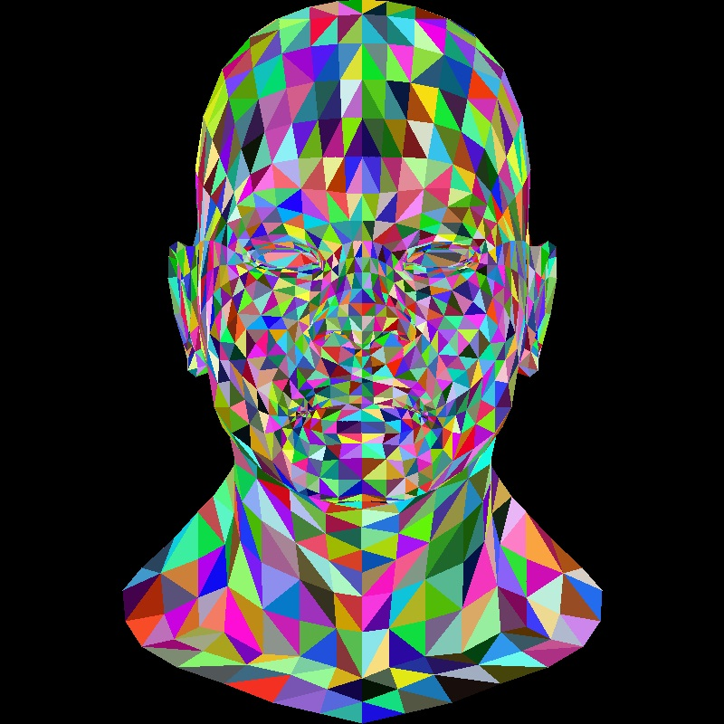

# TinyRenderer
A tiny Renderer from scratch.

## Step by Step

Step 0: Getting started

Step 1: Bresenham’s Line Drawing Algorithm

Step 2: Triangle rasterization and back face culling

Step 3: Hidden faces removal (z buffer)

Step 4: Perspective projection

Step 5: Moving the camera

Step 6: Shaders for the software renderer

Step 6+: Tangent space normal mapping

